# ICSI 403

# Fundamentals

software architectureis produced **先于** a software design

两个重要的目标：**Design for change**应对未来可能出现的变化，**Product families**将正在设计的系统视为一个更大程序家族的一部分，而不是一个孤立的、单一的产品。


Module指的是： **A well-defined component of a software system**，**A part of a system that provides a set of services  to other modules**

模块之间的关系可以用集合描述：

1. **模块集合**：定义了一个模块集合S，其中包含多个模块，表示为 $$S = \{M_1, M_2, M_3, \ldots\} $$。
2. **二元关系**：在集合 S上定义了一个二元关系 r。这个关系是集合 S 与自身的笛卡尔积 $$S \times S $$)的一个子集。也就是说，如果 $M_i $ 和 $M_j$ 是集合 S 中的模块，那么有序对 $\langle M_i, M_j \rangle  $可以属于关系 r，表示为 $M_i \, r \, M_j $。
3. **传递闭包 ( $r^+$)**：传递闭包 $r^+ $是关系 $r$ 的扩展，包含所有通过 $r$ 传递的路径。形式上，$$M_i \, r^+ \, M_j$$  当且仅当：$$M_i \, r^+ \, M_j$$（即 $M_i$  直接与 $M_j$ 有关系），或者存在一个中间模块 $M_k$使得 $$M_i \, r \, M_k $$且 $$M_k \, r^+ \, M_j $$。
4. **层次结构**(hierarchy)：关系r 被称为层次结构，如果不存在两个不同的元素 $M_i $和 $M_j$ 使得 $ M_i \, r^+ \, M_j $且 $ M_j \, r^+ \, M_i $。即不存在循环依赖，关系是单向的，形成一个有向无环图（DAG）。

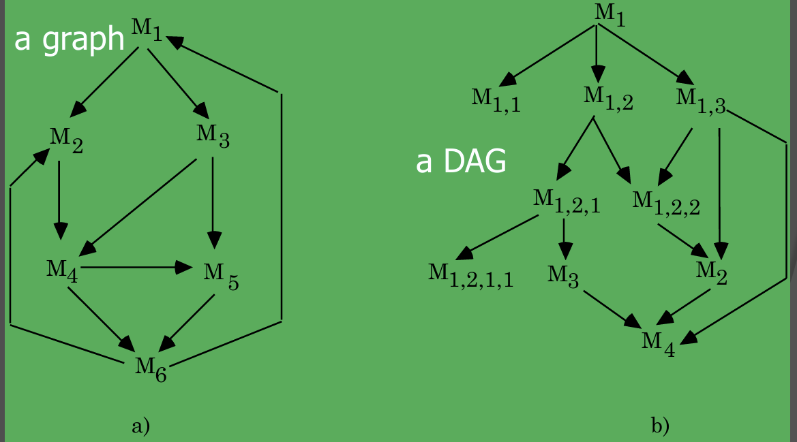


USES关系：一个模型元素需要另一个模型元素——A uses B，则A需要B的**正确结果**，依赖于B来提供**他自己的服务**，A可以通过B的**接口**来访问B的服务，这种关系是“**静态**”定义的，即它在设计或编译时就已经确定，而不是在运行时动态建立的。**这里的A是B的客户，而B是服务端。**

USES关系需要有**层次结构**，这样能让软件更容易被理解，建立和测试。

​	


**Coupling耦合，Cohesion内聚力**这两个指标可以决定一个结构的质量，模块化设计的原则是**高内聚、低耦合**，即每个模块需要**highly cohesive**(module understandable as a meaningful unit以及模块的组件紧密相关)，**Iow coupling**(与其他模块交流较少，可以单独理解）

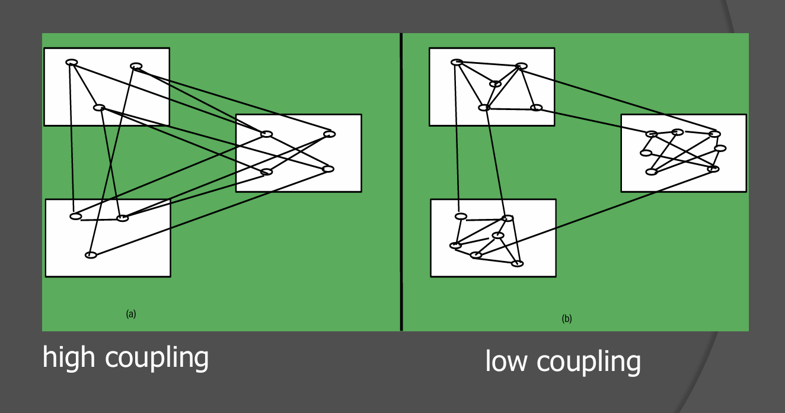


USES关系指的**是某个模块依赖另一个模块的关系**


从**USES**图上理解：一个好的结构需要**low fan-in, high fan-out**，fan-in指模块被使用的频次，high fan-in表示模块经常被其他模块使用，**fan-out指模块调用其他模块的数量**，高扇出表示模块依赖过多的其他模块，缺乏内聚性，是设计不良的表现。


# C++

C++中**系统定义**的标识符以**下划线**开头，并且对**大小写**敏感。

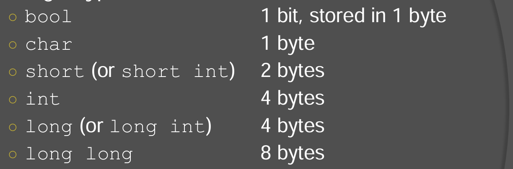


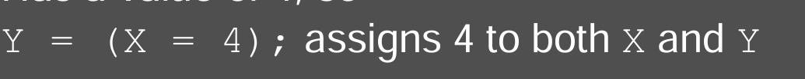


前自增：**先加一再返回**

后自增：**先返回再加一**


可以从**小的数据类型转化到大的数据类型**，反过来需要**显示地定义**，布尔值是例外，会将整数转换为0或1


单引号包裹字符，双引号包裹字符串。


```C++
const int max_value = 100;  // 正确：声明时初始化
max_value = 200;  // 错误：const 变量不能被重新赋值
```


和使用多个cout输出没有区别


下述两个方法设置输出位

```C++
// 设置浮点数输出为定点表示法
cout.setf(ios::fixed);
// 设置小数点后保留 2 位
cout.precision(2);
```

cin可以读取一行(遇到换行符停止)，输入的内容可以用空格分开


不支持/\*\*…*/的注释形式


逻辑判断有**短路**的性质


逻辑判断以下述的形式存在

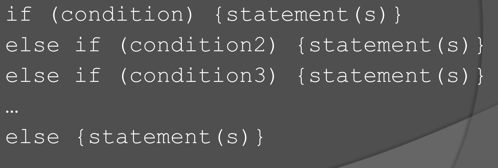


枚举类型 enum Color { red, green, blue };  Color r = red;


使用switch时，需要注意在case之后加上**break**

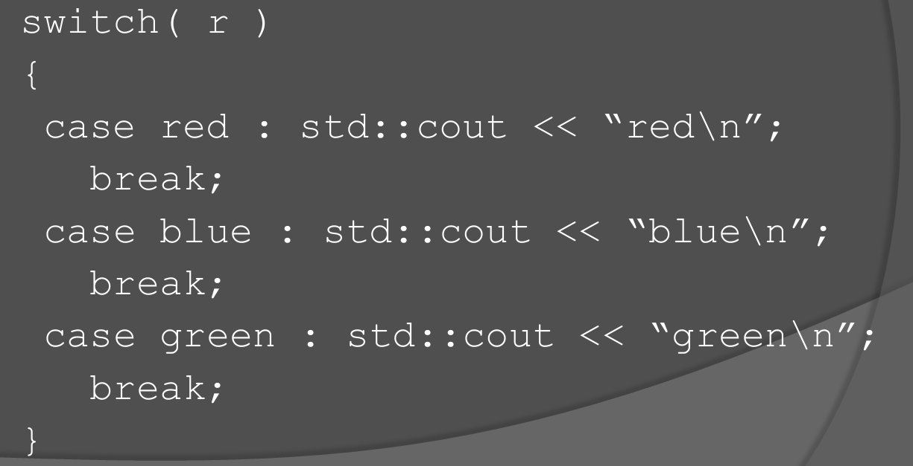


三元运算符


循环

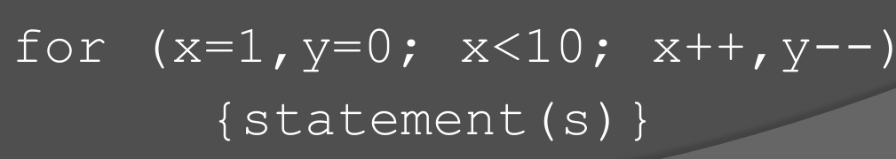

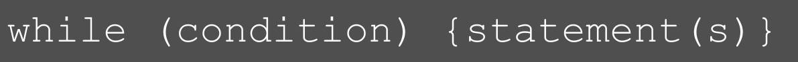


srand()设置随机数种子  rand()设置0到32767之间的随即谁


`exit()`函数定义在`<cstdlib>`头文件中。它的作用是**立即终止程序的执行**，并将控制权返回给操作系统，该函数接受一个参数表示程序的状态退出码，为0表示成功退出。


**按引用传值就是传递变量本身**，&名为ampersand

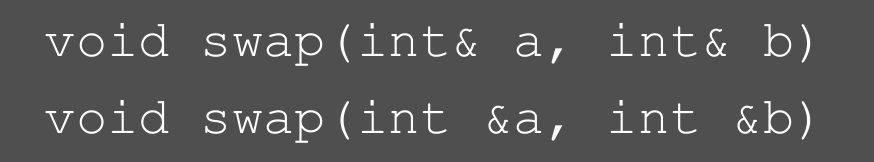

函数重载必须要有**相同的返回值类型**，以及**不同的参数**，对于不同的重载函数，如果参数不能完美匹配会尝试进行**类型转换**再匹配到正确的函数。


默认参数的设置必须从**从右往左**直到**第一个**，传入参数时必须**从左往右填入**，不能跳过。

```C
void func(int a, int b = 20, int c = 30, int d = 40); // 正确
void func(int a = 10, int b, int c = 30); // 错误
void func(int a, int b, int c = 30) // 错误
```

​	

#define**定义** 仅在**编译时可见**的值，一般用于**条件编译**即根据**某个标识符**来决定那些代码需要**被编译**。

\#define TEST 1 定义一个 `TEST` 标识符，它的值为 `1`，这是一个编译时的定义，程序在执行时**不会储存**这个变量。


不同于if else，不满足片段是**不会被编译**的。


assertions断言是一种**调试**工具，通过 \#include \<cassert\>导入，如果 assert (condition)的结果为**False**则程序会**退出执行**。

想要禁用断言，需如下操作

```C++
#define NDEBUG  // 在断言之前定义
#include <cassert>
```


数组的大小不能用**变量**定义，但是**常量**是允许的。

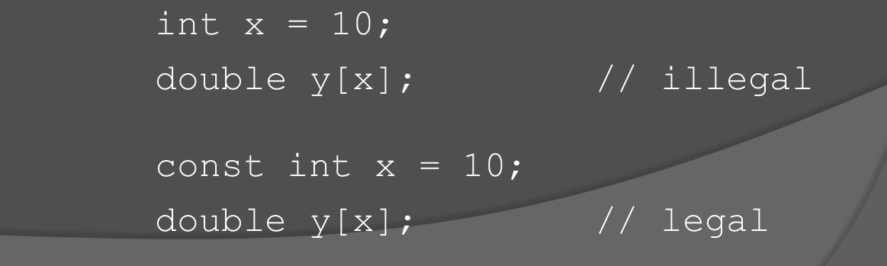

数组作为参数是按照**引用**传递的(可以被**修改**)，但单个数组元素是按传**值**的方式进行的，。

在参数中定义**const**可以防止修改数组


返回数组的函数的返回类型应该定义为指针，而不是数组

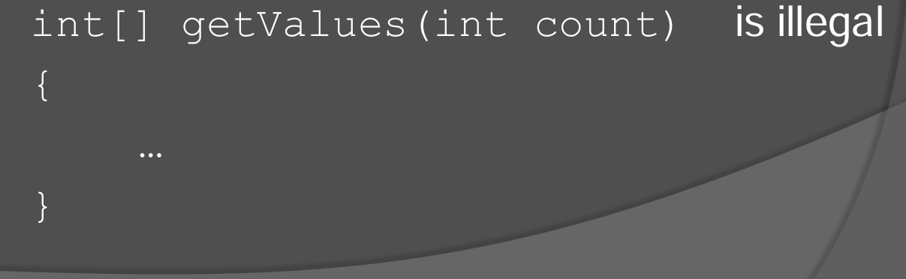


对于多维数组，作为参数时必须**指明**除了第一个维度之外的**维度的大小**

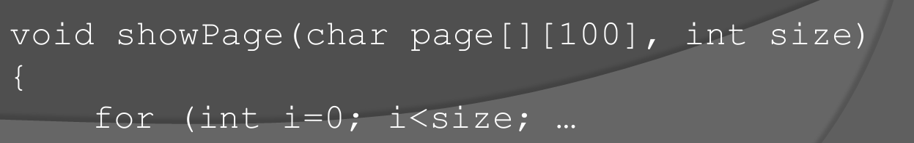


指针可以指向**任何对象**，包括不指向**特定的对象**，可以通过p == q判断两个指针是否指向同一个地址，因为指针直接存储的就是**地址**。


指针的操作演示

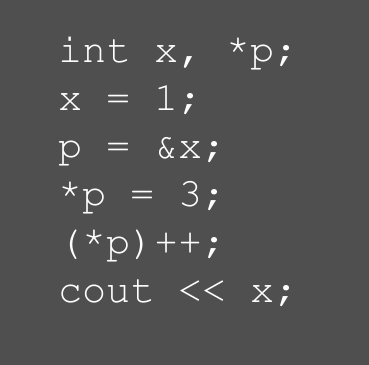

对指针的增加会让指针指向**下一个内存地址**，而不是简单地加 1。它的具体行为取决于指针的 **数据类型**，因为不同类型的变量在内存中的占用大小不同。

​						**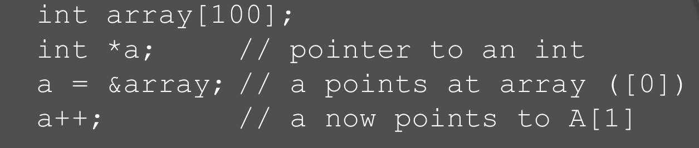**


通过new返回的是一个**地址**，注意要及时**删除**。

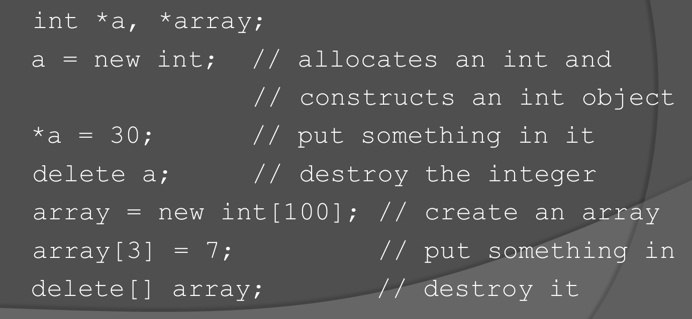


