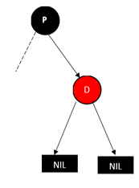
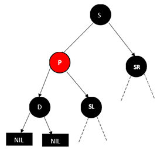
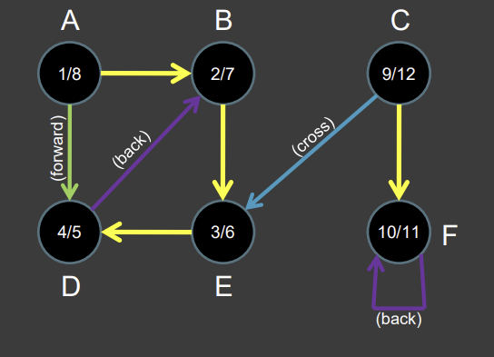
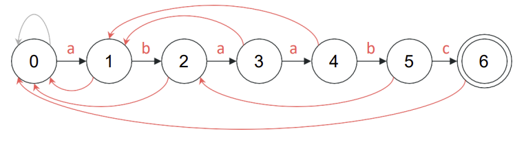

# ICSI 403

# Fundamentals

software architectureis produced **先于** a software design

两个重要的目标：**Design for change**应对未来可能出现的变化，**Product families**将正在设计的系统视为一个更大程序家族的一部分，而不是一个孤立的、单一的产品。


Module指的是： **A well-defined component of a software system**，**A part of a system that provides a set of services  to other modules**

模块之间的关系可以用集合描述：

1. **模块集合**：定义了一个模块集合S，其中包含多个模块，表示为 $$S = \{M_1, M_2, M_3, \ldots\} $$。
2. **二元关系**：在集合 S上定义了一个二元关系 r。这个关系是集合 S 与自身的笛卡尔积 $$S \times S $$)的一个子集。也就是说，如果 $M_i $ 和 $M_j$ 是集合 S 中的模块，那么有序对 $\langle M_i, M_j \rangle  $可以属于关系 r，表示为 $M_i \, r \, M_j $。
3. **传递闭包 ( $r^+$)**：传递闭包 $r^+ $是关系 $r$ 的扩展，包含所有通过 $r$ 传递的路径。形式上，$$M_i \, r^+ \, M_j$$  当且仅当：$$M_i \, r^+ \, M_j$$（即 $M_i$  直接与 $M_j$ 有关系），或者存在一个中间模块 $M_k$使得 $$M_i \, r \, M_k $$且 $$M_k \, r^+ \, M_j $$。
4. **层次结构**(hierarchy)：关系r 被称为层次结构，如果不存在两个不同的元素 $M_i $和 $M_j$ 使得 $ M_i \, r^+ \, M_j $且 $ M_j \, r^+ \, M_i $。即不存在循环依赖，关系是单向的，形成一个有向无环图（DAG）。


USES关系：一个模型元素需要另一个模型元素——A uses B，则A需要B的**正确结果**，依赖于B来提供**他自己的服务**，A可以通过B的**接口**来访问B的服务，这种关系是“**静态**”定义的，即它在设计或编译时就已经确定，而不是在运行时动态建立的。**这里的A是B的客户，而B是服务端。**

USES关系需要有**层次结构**，这样能让软件更容易被理解，建立和测试。

​	

**Coupling耦合，Cohesion内聚力**这两个指标可以决定一个结构的质量，模块化设计的原则是**高内聚、低耦合**，即每个模块需要**highly cohesive**(module understandable as a meaningful unit以及模块的组件紧密相关)，**Iow coupling**(与其他模块交流较少，可以单独理解）


USES关系指的**是某个模块依赖另一个模块的关系**


从**USES**图上理解：一个好的结构需要**low fan-in, high fan-out**，fan-in指模块被使用的频次，high fan-in表示模块经常被其他模块使用，**fan-out指模块调用其他模块的数量**，高扇出表示模块依赖过多的其他模块，缺乏内聚性，是设计不良的表现。


# C++

C++中**系统定义**的标识符以**下划线**开头，并且对**大小写**敏感。


前自增：**先加一再返回**

后自增：**先返回再加一**


可以从**小的数据类型转化到大的数据类型**，反过来需要**显示地定义**，布尔值是例外，会将整数转换为0或1


单引号包裹字符，双引号包裹字符串。


```C++
const int max_value = 100;  // 正确：声明时初始化
max_value = 200;  // 错误：const 变量不能被重新赋值
```


和使用多个cout输出没有区别


下述两个方法设置输出位

```C++
// 设置浮点数输出为定点表示法
cout.setf(ios::fixed);
// 设置小数点后保留 2 位
cout.precision(2);
```

cin可以读取一行(遇到换行符停止)，输入的内容可以用空格分开


不支持/\*\*…*/的注释形式


逻辑判断有**短路**的性质


逻辑判断以下述的形式存在


枚举类型 enum Color { red, green, blue };  Color r = red;


使用switch时，需要注意在case之后加上**break**


三元运算符


循环


srand()设置随机数种子  rand()设置0到32767之间的随即谁


`exit()`函数定义在`<cstdlib>`头文件中。它的作用是**立即终止程序的执行**，并将控制权返回给操作系统，该函数接受一个参数表示程序的状态退出码，为0表示成功退出。


## 参数

**按引用传值就是传递变量本身**，&名为ampersand


函数重载必须要有**相同的返回值类型**，以及**不同的参数**，对于不同的重载函数，如果参数不能完美匹配会尝试进行**类型转换**再匹配到正确的函数。


默认参数的设置必须从**从右往左**直到**第一个**，传入参数时必须**从左往右填入**，不能跳过。

```C
void func(int a, int b = 20, int c = 30, int d = 40); // 正确
void func(int a = 10, int b, int c = 30); // 错误
void func(int a, int b, int c = 30) // 错误
```

​	

## 预定义指令

#define**定义** 仅在**编译时可见**的值，一般用于**条件编译**即根据**某个标识符**来决定那些代码需要**被编译**。

\#define TEST 1 定义一个 `TEST` 标识符，它的值为 `1`，这是一个编译时的定义，程序在执行时**不会储存**这个变量。


不同于if else，不满足片段是**不会被编译**的。


assertions断言是一种**调试**工具，通过 \#include \<cassert\>导入，如果 assert (condition)的结果为**False**则程序会**退出执行**。

想要禁用断言，需如下操作

```C++
#define NDEBUG  // 在断言之前定义
#include <cassert>
```


## 数组

数组的大小不能用**变量**定义，但是**常量**是允许的。


数组作为参数是按照**引用**传递的(可以被**修改**)，但单个数组元素是按传**值**的方式进行的，。

在参数中定义**const**可以防止修改数组


返回数组的函数的返回类型应该定义为指针，而不是数组


对于多维数组，作为参数时必须**指明**除了第一个维度之外的**维度的大小**


## 指针

指针可以指向**任何对象**，包括不指向**特定的对象**，可以通过p == q判断两个指针是否指向同一个地址，因为指针直接存储的就是**地址**。


指针的操作演示


对指针的增加会让指针指向**下一个内存地址**，而不是简单地加 1。它的具体行为取决于指针的 **数据类型**，因为不同类型的变量在内存中的占用大小不同。

​						****


通过new返回的是一个**地址**，注意要及时**删除**。


## 结构体和类

结构体如下，结构体之间的赋值是内容的转移，除非是指针指向的结构体


通过new创建的结构体即指针类型，需要使用**->**符来访问其中的变量


注意解引用的操作

acct1->balance同(*acct1).balance   *acct1.balance同 *(acct1.balance)


:: 具有**最高的优先级**，在**类外**定义类方法需要使用::，如果在类的内部定义则不需标识符，内部定义的方法是**inline函数**，违背了接口与实现分离的原则。

```C++
class Rectangle {
public:
    int width, height;

    int area(); // 仅声明函数
};

// 在类外部定义函数
int Rectangle::area() {
    return width * height;
}
```


# instruction to algorithm

T(N)：表示时间复杂度函数，一般统计——计算，逻辑控制，数据移动，O(N)：表示当N增大时，T(N) 的增长速度


P类问题：能在**多项式时间**内被**确定性图灵机(个人电脑)**解决的问题，比如选择排序

NP类问题：能在**多项式时间**内被**非确定图灵机**解决的问题——**能在多项式时间内被验证是否正确**，比如TSP，Graph coloring

NP-Hard类问题：需要花费更长的时间去检查，或者是没有一个有效的的问题，包含NP问题(但不仅限于)，比如Halting problem.

NP-Complete问题：是NP类问题，可以在多项式时间内求解，如果能在多项式时间内解决NP-complete问题，那么**所有**的NP问题都在多项式时间内解决，比如哈密顿回路(Hamiltonian Cycle)。


**所有的NP-Complete都是NP-Hard的子集，但反之不成立。**


尚未证明	


# 插入排序

排序的对象是键（keys），可能伴随satellite data，即一些无法排序或不用排序的值


插入排序适合小规模数据，原地排序，一种增量式(**Incremental**)算法，与分治式相对

$t_j$表示第j个元素在while循环中所需执行的操作次数


注意统计执行次数时，循环的执行次数比实际次数多一


总计


插入排序在最好的情况下while 循环不会执行，时间复杂度可以表示为an+b


最坏的情况下，while循环会执行j次（比实际多一），这样总的时间复杂度


一般时间复杂度都指的是最坏情况下，而平均情况和最坏情况大致一样。


O表示的是渐进时间复杂度，只保留最高项并且去除常数，注意和T不能搞混。


# 二分查找

二分查找的时间复杂度计算涉及到递归，有式子


# 归并排序


对于一个大小为 $n$ 的问题，设 $T(n)$ 表示解决该问题的时间复杂度。分治算法的递推关系通常写成如下形式：
$$
T(n) = aT\left(\frac{n}{b}\right) + D(n) + C(n)
$$
其中：

- $a$：将问题分解成的子问题的个数。
- $\frac{n}{b}$：每个子问题的规模（即原问题被分成规模为 $n/b$ 的子问题）。
- $T\left(\frac{n}{b}\right)$：解决每个子问题所需的时间。
- $D(n)$：分解问题所需的时间（通常是常数时间）。
- $C(n)$：合并子问题的解所需的时间。

当问题规模足够小时，可以直接暴力求解，只需常数时间


归并排序基于分治的思想，数据规模较小时，插入排序的表现更好，反之归并排序更好，归并排序最坏的情况比插入排序好


​	


# 树结构

树是**非线性结构**，不能有**环**，通常用于维护**有序数据**

节点的实现中包含了**指向父节点的指针**，节点只能有**一个父节点**，且指向子树的指针(successor pointers)不同指向**同一个节点**，用**NIL**表示NULL

令根节点的为level0，叶子结点的level就是高度，如果树中存在一个节点的**左右子树的高度不同**

对于**高为n**的树，其**至多**有

- **Leaves (叶子节点)**: $2^n $
- **Non-leaf nodes (非叶子节点)**: $ 2^n - 1$ 
- **Total nodes (总节点数)**: $2^{n+1} - 1$


完全二叉树(complete tree)**除了叶子节点**每一层的节点都连接两个子节点，且未填的靠**左**，有**N**个节点的完全二叉树，其高为**log(N)下取整**

二叉搜索树上的最小值为二叉搜索树**左链的顶点**，最大值为**二叉搜索树右链的顶点**，对于**相等**的值往**右子树**走


**Predecessors/Successors**指的是**中序**下节点X的**前一位和后一位**，Successors——如果有**右子树**，那么就是右子树的**最左叶子节点**，反之则是它的最**近共公祖先**。


注意二叉树的插入操作，需要快慢指针操作，慢指针表示父节点，快指针指向遍历的位置


删除操作分类讨论

删除节点仅有左子树或右子树，则让该节点的父节点指向其子树(保持相同方向)，然后删除该节点


如果左右子树都存在那么该节点与其中序下一位交换，然后删除该节点


# 堆排序

堆排序**结合**了归并排序和插入排序的优点，与归并排序一样保证最坏的时间复杂度是**nlog(n)**，它是**原地**排序不需要**额外的空间**，与快排相比也不需要**栈开销**，但**一般没有快排快**。

堆是一个**完全二叉树**，因此树高是log(n)，堆的操作的时间复杂度也是log(n)

h.heapsize指代有多少元素是属于堆的

对于节点i，它的左子树是**i*2**，右子树是**2\*i+1**，父节点是**floor(i/2)**，注意课件中的版本i从1开始

MAX-HEAPIFY操作中保证当前**节点的值是其与子树的值中最大的**(通过交换实现)，如果节点被交换过，那么**继续操作子树**(继续向下调整)，反之说明**堆结构**是完好的。


节点的高度是节点到**叶子结点**的**最长**距离，树的高度就是**根节点的高度**


建堆的过程是从**叶子节点的父节点**开始往上(长度折半下取整)，因为**叶子节点本身已经是一个根堆了**	


**从结尾开始与堆首交换，完成排序当前最大值的排序，然后缩小堆的大小。**


优先队列的功能


提取出最大的然后将堆中最小的值放到根节点，再调整堆	


不允许改小节点的值，如果节点的值修改后能大于其父节点，那么就将节点与父节点交换，然后向上检查


插入一个新的节点的值，先扩大堆的大小初始化新节点为-inf，再调用heap_insert_key()


# 哈夫曼树

设二叉树具有**n**个带权叶结点，从根结点到各叶结点的路径长度与相应叶节点权值的乘积之和称为 **树的带权路径长度（Weighted Path Length of Tree，WPL)**


如上图所示，其WPL计算过程与结果：WPL=2\*2+3\*2+4\*2+7\*2=4+6+8+14=32

对于给定一组具有确定权值的叶结点，可以构造出不同的二叉树，其中，**WPL最小的二叉树** 称为 **霍夫曼树（Huffman Tree）**。

对于霍夫曼树来说，其叶结点权值越小，离根越远，叶结点权值越大，离根越近，此外其仅有**叶结点的出度为 0**，其他结点**出度均为 2**（也就是必然有两个**子节点**）

霍夫曼算法用于构建一颗霍夫曼树，步骤如下

1. **初始化**：由给定的n个权值构造**n棵**只有**一个根节点**的二叉树，得到一个二叉树集合 F。
2. **选取与合并**：从二叉树集合中选取**根节点**权值**最小的两棵(有多个相同则任意)** 二叉树分别作为左右子树构造一棵**新的二叉树**，这棵新二叉树的根节点的权值为其左、右子树**根结点**的权值和。
3. **删除与加入**：从中删除作为左、右子树的两棵二叉树，并将新建立的二叉树加入到中。
4. **重复 2、3 步**，当集合中只剩下**一棵**二叉树时，这棵二叉树就是霍夫曼树。

实现如下，霍夫曼树是自下而上构建的

```python
# 构建节点
class Node:
    def __init__(self,w,l=None,r=None):
        self.weight=w
        self.l=l
        self.r=r
    # 定于<比较的对象
    def __lt__(self,other):
        return self.weight<other.weight


n=R()
# 堆
h=[Node(x) for x in RR()]

heapify(h)
while len(h)>1:
    a=heappop(h)
    b=heappop(h)
    # 创建节点
    new_node=Node(a.weight+b.weight,a,b)
    heappush(h,new_node)
root=heappop(h)

# 层级遍历输出
d=deque([root])
while d:
    for _ in range(len(d)):
        node=d.popleft()
        print(node.weight)
        if node.l:d.append(node.l)
        if node.r:d.append(node.r)
```


在进行二进制编码的时，假设所有的代码都等长，那么表示N个不同的字符需要**logN**位，称为等长编码。

如果每个字符的**使用频率相等**，那么**等长编码**无疑是空间效率最高的编码，而如果字符串出现的**频率不同**，则可以让**频率高的字符采用尽可能短的编码，频率低的字符采用尽可能长的编码**，来构造出一种**不等长编码**，从而获得更好的**空间效率**。

在构造不等长的编码时要考虑**解码的唯一性**，如果一组编码中的**任意编码**都不是其他任何一个编码的**前缀**，那么这组编码称为**前缀编码**，其保证了**编码被解码时的唯一**。

霍夫曼树可用于构建**最短前缀编码**，以**字符出现的频率**为权重构建霍夫曼树(权重只在建树中有用)

规定树的**左枝为0，右枝为1**，**从根节点到叶子结点的路径即为字符的编码**，叶子节点有权重和频率，非叶子节点internal node只有频率。


**哈夫曼树越不平衡(字符频率差异显著)，压缩的效率就越高**，它是一颗二叉树但不是**二叉搜索树**，经过数学证明的是，**基于单个字符频率的压缩是最优的**

解码的性质，从根结点开始读入字符，走到**叶子节点**就解码了一个字符，然后继续从根节点开始操作，当所有的字符都处理完毕，此时应该**位于叶子节点**。


计算机中一般使用**固定的位数**工作，即把**压缩后的结果分为大小固定的块**，压缩后的结果可能需要**填充位(padding bits)**来补充


填充位可以使用**空格(最多3个)**，或者特殊字符(修改字母表)，或者**使用某一段前缀**，使得不会走到**叶子节点**，比如说最长的编码，如果它大于所需的填充位数，那么就可以用作填充位(截断)


# 红黑树

红黑树是一个**自平衡的二叉搜索树**（h ≤ 2 lg(n+1)），每个树额外储存了一个**color字段**(RED BLACK)，用于确保树在**插入或者删除**时保持平衡。退化的树的高度等于N。

注意红黑树并不追求**绝对平衡**——其保证从根节点到最远叶子的最长路径不会超过最短路径的**2倍**（mostly balanced）

红黑树中要求所有的**叶子节点**为都是空节点，它们不储存数据仅作为占位标记，所有的信息都存储在**内部节点**(非叶子节点上)，空叶子节点指向一个共享的特殊节点，称为NIL(一个全局的空节点对象，颜色是黑色，代表所有空子节点)


合法的红黑树必须遵循以下性质：

1. **节点为红色或者黑色**
2. **根节点为黑色**
3. **NIL节点(空叶子节点)为黑色**
4. **红色节点的子节点为黑色，不要求红黑交替**
5. **从根节点到NIL上路径上，黑色节点的个数一样多(不包括自己，但是计算NIL)**


自平衡的树结构一般都需要旋转操作，红黑树的旋转操作和AVL树相同，左旋右旋是以根节点(当前子树)为准的


节点结构中包含有父节点


插入操作，首先快慢指针找到插入位置的父节点，如果父节点是NIL，则说明插入的是根节点，从代码中可知，所有的叶子节点都是NIL


一定要注意旋转的是**祖父节点**，注意优先级

插入操作，注意节点默认是**红色**的

1. **空树**，直接插入无需修正
2. 当前节点的**父节点为黑色**，无需修正
3. 当前节点的**父节点为红色且为根节点**，将根节点染为**黑色**
4. 当前节点**父节点以及叔父节点均为红色**(优先级**更高**)，则将**二者染黑**，**祖父染红**，递归维护**祖父节点**，如果祖父节点是根节点，那么需要染黑，即出现连续的黑色的情况
5. 当前节点N与父节点P方向相反(即 N 节点为右子节点且父节点为左子节点，或 N 节点为左子节点且父节点为右子节点)，需要旋转为方向相同的结构，然后执行操作6
6. 若N为左子节点，则右旋祖父节点G，反之左旋，然后将P染黑，G染红


需要**旋转**的操作如下，对于右右/左左的形式，先变化颜色(父节点变为黑，祖父节点变为黑)再旋转


****


一个插入的过程如下：


注意这里也要递归处理——7变换颜色之后和2违反了规则，先处理作为父节点的7


注意11要变为红


红黑树的删除操作，大致分为三种情况：

1. 没有子节点
2. 有一个子节点
3. 有两个子节点


对于case3和一般的树的删除操作一样，找到中序下一位，与其替换然后删除这个下一位，可以转换为删除情况。


**case 1:要删除的节点是红色且没有子树**



直接删除D即可，注意这里不可能出现D有单个子节点的情况，如果有两个子节点需要转换


**case 2:删除的节点为黑色且只有一个子节点**


用子节点替换，并将其染为黑色


**case 3:父节点为红色，兄弟节点为黑色**


变为黑红的形式


**case 4:父节点，兄弟节点和兄弟节点的两个孩子都为黑色的情况**


变为黑红，然后**递归**处理父节点，因为父节点路径上的黑色节点数会减一

删除后可能会违反黑色节点数量要相同的性质，所以继续对P进行删除操作，但保留P节点


**case 5:要删除的节点是黑色，且兄弟节点为红色**


将兄弟节点和父节点的颜色交换，然后旋转。这里**并没有结束**，还要按照case3处理




**case 6:兄弟节点为黑色，远侄节点为红色**


兄弟节点和父节点颜色对调，然后旋转，再将**远侄变为黑色**


**case 7:兄弟节点S为黑色，远侄子节点为黑色，近侄节点为红色**


将近侄节点和兄弟节点颜色互换，然后旋转变为上面的情况


# AVL树

满二叉树和完全二叉树中树高和节点数的关系


完全平衡的树(满二叉树full)的树高需要满足h ≤ (lg N)，AVL树不保证完全平衡，仅满足 h ≤ (~1.4404 lg N)，而红黑树则是 h ≤ (2 lg N)。

AVL树使用平衡因子Balance Factor (BF) ，其取值只能是-1，0，1，等于左子树的高度-右子树的高度。


当一个节点的平衡因子等于2或-2时，意味着出现了不平衡，LL和RR操作与红黑树一致


LR，插入到节点的左子树的右子树


左旋左子树


右旋当前节点


RL，插入到节点的右子树的左子树，先右旋右子树，再左旋当前节点


右旋右子树


再左旋失衡节点


多个失衡节点先处理最末端的(叶子节点到根)，下图所示判断为RL


# 图论

E表示边，V表示点

邻接表的空间复杂度Θ(V+E)，查询是否存在边Θ(degree[u])

邻接矩阵的空间复杂度Θ($V^2$ )，查询边是否存在Θ(1)


全连接的图中应该有n*(n-1)//2边


BFS使用先进先出的队列，时间复杂度是Θ(V+E)

图示中右侧是队列头，每次加入到队尾


DFS森林可能由多个DFS树构成，初始时所有的点的颜色是白色，当一个点被DFS搜索到，就将其染为灰色，回退时再染为黑色。

定义DFS森林中有四种边：

+ Tree edge:：(u,v)中的v是白色
+ Back edge：(u,v)中的v是灰色
+ forward edge：(u,v)中的v是黑色，且u先被访问
+ cross edge：(u,v)中的v是黑色，且u后被访问

下图中先从A开始DFS，再从C开始




拓扑排序是偏序partial orderings


Strongly Connected Components强连通分量，强连通图指的是有向图中两个节点可以相互到达，强连通分量SCC则是顶点集V的一个**极大子集**C⊆V，满足：

- 对于C中的任意两个顶点u和v，u和v互相可达
- 具有**极大性**：不能再添加任何其他顶点而保持强连通性

课件中好像没有给出极大性的要求

# MST

MST指最小生成树，Spanning Trees是生成树，即包含所有节点的极小树(连通且无环)

safe edges 指必然存在于MST中的边

prim算法：从任意一个节点开始，将节点分为两类：已加入的，未加入的，每次从未加入的节点中找一个与已加入的节点中最近的节点，添加这个节点。

最小生成树中的路径是否是最短路，最小的边是否一定包含在其中。都不成立

# greedy

贪心做局部最优解locally-optimized，不会回头或者改变贪心的策略。

哈夫曼树的建立就是一个贪心的过程

0-1 Knapsack Problem离散背包问题，物品不可分割（要么全拿，要么不拿），无法由贪心求解

Fractional Knapsack Problem分数背包，物品只能拿一部分，可以由贪心求解。


# 单源最短路


图中e-f的负边权会导致距离趋向负无穷，但这不意味着有负边权就一定无法得到结果，**Dijkstra不允许出现负权重**


最短路算法不能包括**负权重循环**，同时正权重循环也不会出现


`v.π` 表示：到达 `v` 的最短路径是从哪个点走过来的，如果 `v` 是源点，或者不可达，那么 `v.π = NIL`。


松弛操作Relaxation是一个不断收紧当前路径距离上限的做法

将除了源点的距离都初始化为inf就是松弛操作


- Bellman-Ford对边的松弛操作会进行多次
- Dijkstra每条边最多一次


Bellman-Ford可以处理**负边**，能发现**负环**，核心是对所有边(并不从源点出发)进行松弛操作，无法判断"所有路径是否已经是最短"，总是固定地执行**|V|-1**次遍历


判断负环——**多做一轮松弛，看看有没有变化**


拓扑排序可以优化Bellman-Ford(前提是DAG)，按照拓扑排序遍历点时，不需要跑|V|-1次循环，只需要走该点对应的边数即可，因为此时前面的点已经排好了O(V+E)。


Dijkstra可以看作是贪心


# Graph Applications Pattern Recognition Automata


类似于编译原理中的自动机，双重圈表示接收状态，最终停留在一个**接受状态**才能算accept，提前到达但是最终去了别的位置，或者就没到达，结果是reject.


定义L=L(M)为能被自动机M接收的所有字符串，称为language


一个自动机定义为

- $Q$：状态的**集合**
- Σ：输入**字母表**
- δ：**状态转移函数**，如
- $q_0$：**初始状态**
- F⊆Q：**接受状态集**


Regular Expressions正则表达式

该示例不是正则表达式，因为n是无法被储存的，没有FA能接收这种表达式

- $\emptyset$：表示**空语言**，即什么都不接受。
- $\lambda$：表示**空串**，长度为0的字符串。
- $r_1 + r_2$：或 
- 连接 $r_1 \cdot r_2$：表示先匹配 $r_1$，然后匹配 $r_2$
- 闭包 $r_1^*$：表示匹配$r_1$任意多次


示例如下


Regular Languages有三种等价的标准表示方式：

+  **FAS(DFA)** – 有限自动机
+  **NFAs** – 非确定性有限自动机，一个输入可以有多个转移，甚至可以有空串转移，实际上和DFA一样，因为每个NFA可以转换为DFA
+ **Regular Expressions**（正则表达式）


# KMP

字符串匹配暴力的做法是O(MN)，KMP的时间复杂度是O(M+N)

build得到的数组是每个前缀和后缀匹配的个数，对于第一个位置默认为0


课件中定义f(i)表示得到的arr


随后根据表的内容建立前向边指向f[i]对应的编号




然后在自动机上走


不匹配就走前向边回退，，一旦走到初始状态仍不能匹配，S指针就继续向前


注意，最终仍会做一次回退。


