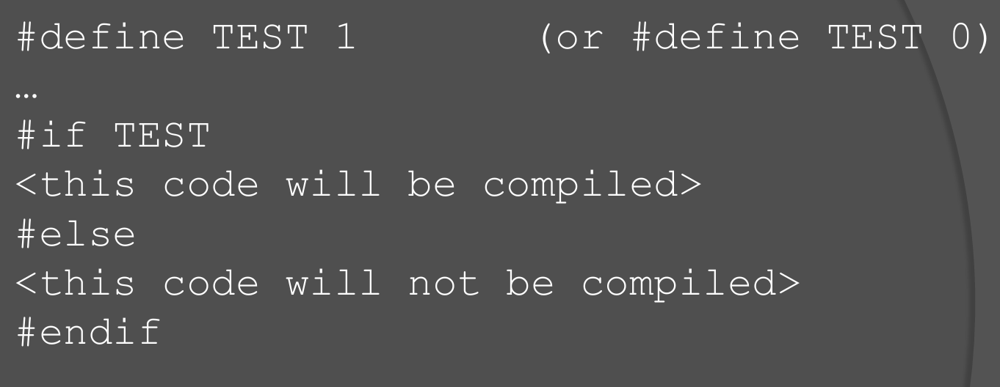
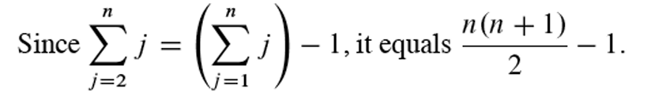

# ICSI 403

# Fundamentals

software architectureis produced **先于** a software design

两个重要的目标：**Design for change**应对未来可能出现的变化，**Product families**将正在设计的系统视为一个更大程序家族的一部分，而不是一个孤立的、单一的产品。


Module指的是： **A well-defined component of a software system**，**A part of a system that provides a set of services  to other modules**

模块之间的关系可以用集合描述：

1. **模块集合**：定义了一个模块集合S，其中包含多个模块，表示为 $$S = \{M_1, M_2, M_3, \ldots\} $$。
2. **二元关系**：在集合 S上定义了一个二元关系 r。这个关系是集合 S 与自身的笛卡尔积 $$S \times S $$)的一个子集。也就是说，如果 $M_i $ 和 $M_j$ 是集合 S 中的模块，那么有序对 $\langle M_i, M_j \rangle  $可以属于关系 r，表示为 $M_i \, r \, M_j $。
3. **传递闭包 ( $r^+$)**：传递闭包 $r^+ $是关系 $r$ 的扩展，包含所有通过 $r$ 传递的路径。形式上，$$M_i \, r^+ \, M_j$$  当且仅当：$$M_i \, r^+ \, M_j$$（即 $M_i$  直接与 $M_j$ 有关系），或者存在一个中间模块 $M_k$使得 $$M_i \, r \, M_k $$且 $$M_k \, r^+ \, M_j $$。
4. **层次结构**(hierarchy)：关系r 被称为层次结构，如果不存在两个不同的元素 $M_i $和 $M_j$ 使得 $ M_i \, r^+ \, M_j $且 $ M_j \, r^+ \, M_i $。即不存在循环依赖，关系是单向的，形成一个有向无环图（DAG）。


USES关系：一个模型元素需要另一个模型元素——A uses B，则A需要B的**正确结果**，依赖于B来提供**他自己的服务**，A可以通过B的**接口**来访问B的服务，这种关系是“**静态**”定义的，即它在设计或编译时就已经确定，而不是在运行时动态建立的。**这里的A是B的客户，而B是服务端。**

USES关系需要有**层次结构**，这样能让软件更容易被理解，建立和测试。

​	


**Coupling耦合，Cohesion内聚力**这两个指标可以决定一个结构的质量，模块化设计的原则是**高内聚、低耦合**，即每个模块需要**highly cohesive**(module understandable as a meaningful unit以及模块的组件紧密相关)，**Iow coupling**(与其他模块交流较少，可以单独理解）


USES关系指的**是某个模块依赖另一个模块的关系**


从**USES**图上理解：一个好的结构需要**low fan-in, high fan-out**，fan-in指模块被使用的频次，high fan-in表示模块经常被其他模块使用，**fan-out指模块调用其他模块的数量**，高扇出表示模块依赖过多的其他模块，缺乏内聚性，是设计不良的表现。


# C++

C++中**系统定义**的标识符以**下划线**开头，并且对**大小写**敏感。


前自增：**先加一再返回**

后自增：**先返回再加一**


可以从**小的数据类型转化到大的数据类型**，反过来需要**显示地定义**，布尔值是例外，会将整数转换为0或1


单引号包裹字符，双引号包裹字符串。


```C++
const int max_value = 100;  // 正确：声明时初始化
max_value = 200;  // 错误：const 变量不能被重新赋值
```


和使用多个cout输出没有区别


下述两个方法设置输出位

```C++
// 设置浮点数输出为定点表示法
cout.setf(ios::fixed);
// 设置小数点后保留 2 位
cout.precision(2);
```

cin可以读取一行(遇到换行符停止)，输入的内容可以用空格分开


不支持/\*\*…*/的注释形式


逻辑判断有**短路**的性质


逻辑判断以下述的形式存在


枚举类型 enum Color { red, green, blue };  Color r = red;


使用switch时，需要注意在case之后加上**break**


三元运算符


循环


srand()设置随机数种子  rand()设置0到32767之间的随即谁


`exit()`函数定义在`<cstdlib>`头文件中。它的作用是**立即终止程序的执行**，并将控制权返回给操作系统，该函数接受一个参数表示程序的状态退出码，为0表示成功退出。


## 参数

**按引用传值就是传递变量本身**，&名为ampersand


函数重载必须要有**相同的返回值类型**，以及**不同的参数**，对于不同的重载函数，如果参数不能完美匹配会尝试进行**类型转换**再匹配到正确的函数。


默认参数的设置必须从**从右往左**直到**第一个**，传入参数时必须**从左往右填入**，不能跳过。

```C
void func(int a, int b = 20, int c = 30, int d = 40); // 正确
void func(int a = 10, int b, int c = 30); // 错误
void func(int a, int b, int c = 30) // 错误
```

​	

## 预定义指令

#define**定义** 仅在**编译时可见**的值，一般用于**条件编译**即根据**某个标识符**来决定那些代码需要**被编译**。

\#define TEST 1 定义一个 `TEST` 标识符，它的值为 `1`，这是一个编译时的定义，程序在执行时**不会储存**这个变量。


不同于if else，不满足片段是**不会被编译**的。




assertions断言是一种**调试**工具，通过 \#include \<cassert\>导入，如果 assert (condition)的结果为**False**则程序会**退出执行**。

想要禁用断言，需如下操作

```C++
#define NDEBUG  // 在断言之前定义
#include <cassert>
```


## 数组

数组的大小不能用**变量**定义，但是**常量**是允许的。


数组作为参数是按照**引用**传递的(可以被**修改**)，但单个数组元素是按传**值**的方式进行的，。

在参数中定义**const**可以防止修改数组


返回数组的函数的返回类型应该定义为指针，而不是数组


对于多维数组，作为参数时必须**指明**除了第一个维度之外的**维度的大小**


## 指针

指针可以指向**任何对象**，包括不指向**特定的对象**，可以通过p == q判断两个指针是否指向同一个地址，因为指针直接存储的就是**地址**。


指针的操作演示


对指针的增加会让指针指向**下一个内存地址**，而不是简单地加 1。它的具体行为取决于指针的 **数据类型**，因为不同类型的变量在内存中的占用大小不同。

​						****


通过new返回的是一个**地址**，注意要及时**删除**。


## 结构体和类

结构体如下，结构体之间的赋值是内容的转移，除非是指针指向的结构体


通过new创建的结构体即指针类型，需要使用**->**符来访问其中的变量


注意解引用的操作

acct1->balance同(*acct1).balance   *acct1.balance同 *(acct1.balance)


:: 具有**最高的优先级**，在**类外**定义类方法需要使用::，如果在类的内部定义则不需标识符，内部定义的方法是**inline函数**，违背了接口与实现分离的原则。

```C++
class Rectangle {
public:
    int width, height;

    int area(); // 仅声明函数
};

// 在类外部定义函数
int Rectangle::area() {
    return width * height;
}
```


# instruction to algorithm

P类问题：能在**多项式时间**内被**确定性图灵机**解决的问题，比如选择排序


NP类问题：能在**多项式时间**内被**非确定图灵机**解决的问题，**算起来不知道快不快**，但可以在多项式时间内验证这个问题。


NP-Hard类问题：需要花费更长的时间去检查，或者是没有一个有效的解的问题。


NP-Complete问题：存在这样一个NP问题，所有的NP问题都可以**约化**成它。换句话说，只要**解决**了这个问题，那么**所有**的NP问题都解决了。


**所有的NP-Complete都是NP-Hard的子集，但反之不成立。**


# 插入排序

tj表示第j个元素在while循环中所需执行的操作次数


注意统计执行次数时，循环的执行次数比实际次数多一


插入排序在最好的情况下while 循环不会执行，时间复杂度可以表示为an+b


最坏的情况下，while循环会执行j次（比实际多一），这样总的时间复杂度




一般时间复杂度都指的是最坏情况下，而平均情况和最坏情况大致一样。


O表示的是渐进时间复杂度，只保留最高项并且去除常数，注意和T不能搞混。


# 二分查找

二分查找的时间复杂度计算涉及到递归，有式子


# 归并排序


​	


# 树结构

树是**非线性结构**，不能有**环**，通常用于维护**有序数据**

节点的实现中包含了**指向父节点的指针**，节点只能有**一个父节点**，且指向子树的指针(successor pointers)不同指向**同一个节点**，用**NIL**表示NULL

令根节点的为level0，叶子结点的level就是高度，如果树中存在一个节点的**左右子树的高度不同**

对于**高为n**的树，其**至多**有

- **Leaves (叶子节点)**: $2^n $
- **Non-leaf nodes (非叶子节点)**: $ 2^n - 1$ 
- **Total nodes (总节点数)**: $2^{n+1} - 1$


完全二叉树**除了叶子节点**每一层的节点都连接两个子节点，有**N**个节点的完全二叉树，其高为**log(N)下取整**

二叉搜索树上的最小值为二叉搜索树**左链的顶点**，最大值为**二叉搜索树右链的顶点**，对于**相等**的值往**右子树**走


**Predecessors/Successors**指的是**中序**下节点X的**前一位和后一位**，Successors——如果有**右子树**，那么就是右子树的**最左叶子节点**，反之则是它的最**近共公祖先**。


注意二叉树的插入操作，需要快慢指针操作，慢指针表示父节点，快指针指向遍历的位置


删除操作分类讨论

若root只有一个子节点，那么返回这个子节点

若root为叶子节点——直接删除即可，设置父节点的next指针为Null


若root有两个子节点，将该节点用中序下的后一位代替，然后删除该节点


# 堆排序

堆排序结合了归并排序和插入排序的优点，与归并排序一样保证最坏的时间复杂度是**nlog(n)**，它是**原地**排序不需要**额外的空间**，与快排相比也不需要**栈开销**，但一般没有快排快。

堆是一个**完全二叉树**，因此树高是log(n)，堆的操作的时间复杂度也是log(n)

h.heapsize指代有多少元素是属于堆的

对于节点i，它的左子树是**i*2**，右子树是**2\*i+1**，父节点是**floor(i/2)**，注意课件中的版本i从1开始

MAX-HEAPIFY操作中保证当前**节点的值是其与子树的值中最大的**(通过交换实现)，如果节点被交换过，那么**继续操作子树**(继续向下调整)，反之说明**堆结构**是完好的。


建堆的过程是从**叶子节点的父节点**开始往上，因为**叶子节点本身已经是一个根堆了**	


**从结尾开始与堆首交换，完成排序当前最大值的排序，然后缩小堆的大小。**


优先队列的功能


不允许改小节点的值，将节点与父节点交换


# 哈夫曼树

设二叉树具有**n**个带权叶结点，从根结点到各叶结点的路径长度与相应叶节点权值的乘积之和称为 **树的带权路径长度（Weighted Path Length of Tree，WPL)**


如上图所示，其 WPL 计算过程与结果：WPL=2*2+3*2+4*2+7*2=4+6+8+14=32

对于给定一组具有确定权值的叶结点，可以构造出不同的二叉树，其中，**WPL 最小的二叉树** 称为 **霍夫曼树（Huffman Tree）**。

对于霍夫曼树来说，其叶结点权值越小，离根越远，叶结点权值越大，离根越近，此外其仅有**叶结点的出度为 0**，其他结点**出度均为 2**（也就是必然有两个**子节点**）

霍夫曼算法用于构建一颗霍夫曼树，步骤如下

1. **初始化**：由给定的 n个权值构造 **n 棵**只有**一个根节点**的二叉树，得到一个二叉树集合 F。
2. **选取与合并**：从二叉树集合  中选取根节点权值 **最小的两棵(有多个相同则任意)** 二叉树分别作为左右子树构造一棵**新的二叉树**，这棵新二叉树的根节点的权值为其左、右子树根结点的权值和。
3. **删除与加入**：从  中删除作为左、右子树的两棵二叉树，并将新建立的二叉树加入到  中。
4. **重复 2、3 步**，当集合中只剩下**一棵**二叉树时，这棵二叉树就是霍夫曼树。

实现如下

```python
# 构建节点
class Node:
    def __init__(self,w,l=None,r=None):
        self.weight=w
        self.l=l
        self.r=r
    # 定于<比较的对象
    def __lt__(self,other):
        return self.weight<other.weight


n=R()
# 堆
h=[Node(x) for x in RR()]

heapify(h)
while len(h)>1:
    a=heappop(h)
    b=heappop(h)
    # 创建节点
    new_node=Node(a.weight+b.weight,a,b)
    heappush(h,new_node)
root=heappop(h)

# 层级遍历输出
d=deque([root])
while d:
    for _ in range(len(d)):
        node=d.popleft()
        print(node.weight)
        if node.l:d.append(node.l)
        if node.r:d.append(node.r)
```


在进行二进制编码的时，假设所有的代码都等长，那么表示N个不同的字符需要**logN**位，称为等长编码。

如果每个字符的**使用频率相等**，那么**等长编码**无疑是空间效率最高的编码，而如果字符串出现的**频率不同**，则可以让**频率高的字符采用尽可能短的编码，频率低的字符采用尽可能长的编码**，来构造出一种**不等长编码**，从而获得更好的**空间效率**。

在构造不等长的编码时要考虑**解码的唯一性**，如果一组编码中的**任意编码**都不是其他任何一个编码的**前缀**，那么这组编码称为**前缀编码**，其保证了**编码被解码时的唯一**。

霍夫曼树可用于构建**最短前缀编码**

规定树的**左枝为0，右枝为1**，**从根节点到叶子结点的路径即为字符的编码**


**哈夫曼树越不平衡(字符频率差异显著)，压缩的效率就越高**


解码的性质，从根结点开始读入字符，走到**叶子节点**就解码了一个字符，然后继续从根节点开始操作，当所有的字符都处理完毕，此时应该**位于叶子节点**。


计算机中一般使用**固定的位数**工作，即把**压缩后的结果分为大小固定的块**，压缩后的结果可能需要**填充位**来补充


填充位可以使用**空格**，或者**使用某一段前缀**，使得不会走到**叶子节点**


# 红黑树

红黑树是一个**自平衡的二叉搜索树**（树高<=**2lg(n+1)**），每个树额外储存了一个**color字段**(RED BLACK)，用于确保树在**插入或者删除**时保持平衡

注意红黑树并不追求**绝对平衡**——高度只差最多为**2**

红黑树中要求所有的**叶子节点**为**空**(NIL)，所有的信息都存储在**内部节点**(非叶子节点上)，**根节点**的父节点也是NIL


合法的红黑树必须遵循以下性质：

1. **节点为红色或者黑色**
2. **根节点为黑色**
3. **NIL节点(空叶子节点)为黑色**
4. **红色节点的子节点为黑色，不要求红黑交替**
5. **从根节点到NIL上路径上，黑色节点的个数一样多**


自平衡的树结构一般都需要旋转操作，红黑树的旋转操作和AVL树相同


插入操作，注意节点初始默认是**红色**的

1. **空树**，直接插入无需修正
2. 当前节点的**父节点为黑色**，无需修正
3. 当前节点的**父节点为红色且为根节点**，将根节点染为**黑色**
4. 当前节点**父节点以及叔父节点均为红色**，则将**二者染黑**，**祖父染红**，递归维护**祖父节点**，如果祖父节点是根节点，那么需要染黑，即出现连续的黑色的情况
5. 当前节点N与父节点P方向相反(即 N 节点为右子节点且父节点为左子节点，或 N 节点为左子节点且父节点为右子节点)，需要旋转为方向相同的结构，然后执行操作6
6. 若N为左子节点，则右旋祖父节点G，反之左旋，然后将P染黑，G染红


需要**旋转**的操作如下，对于右右/左左的形式，先变化颜色再旋转


****


一个插入的过程如下：


